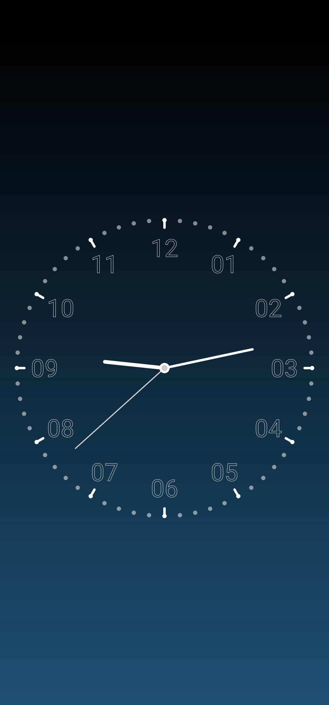

# Assignment4

代码在Clock文件夹中。

由于Github对md文件中图片格式的显示问题，缩放没有办法正常显示，本readme在网页端的图片大小可能看起来过大。可以clone下来，在其他软件上查看。

## Implementation

1. 实现一个有指针跳动的动态时钟界面，包括时针、分针、秒针；
2. 加上了数字刻度和中心的圆圈；
3. 对外圈的刻度线做了一定的改进（改成了点+线）

## Environment

开发环境：Android Studio

## Result

页面1：

页面2：（可以看出这个刻度是会随时间变化的）

