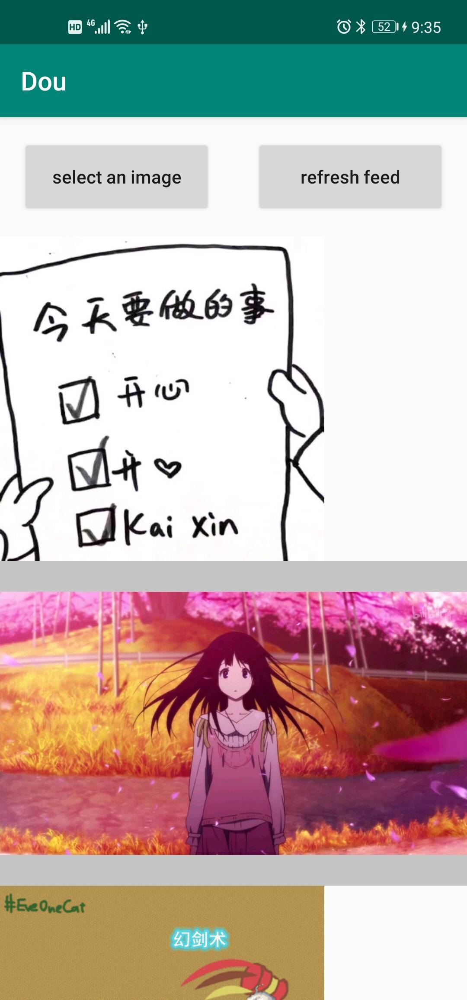

# Assignment5

代码在dou文件夹中。

由于Github对md文件中图片格式的显示问题，缩放没有办法正常显示，本readme在网页端的图片大小可能看起来过大。可以clone下来，在其他软件上查看。

## Implementation

1. 用户可以自己上传图片和视频
2. 做了去重处理，只保留了每个id的最后一个图片和视频

## Environment

开发环境：Android Studio

## Result

本次作业主要并不是前面的设计UI相关，难以用截图体现效果，这里仅放一张界面图：

