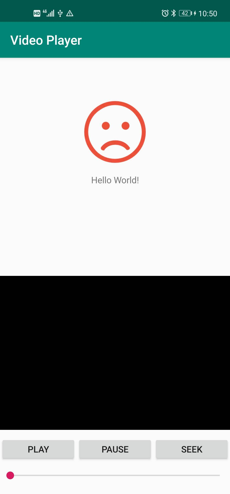
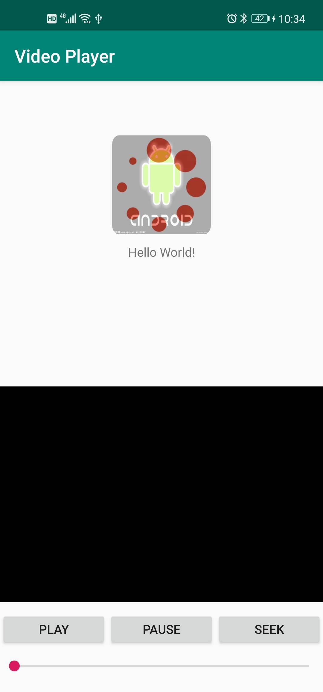
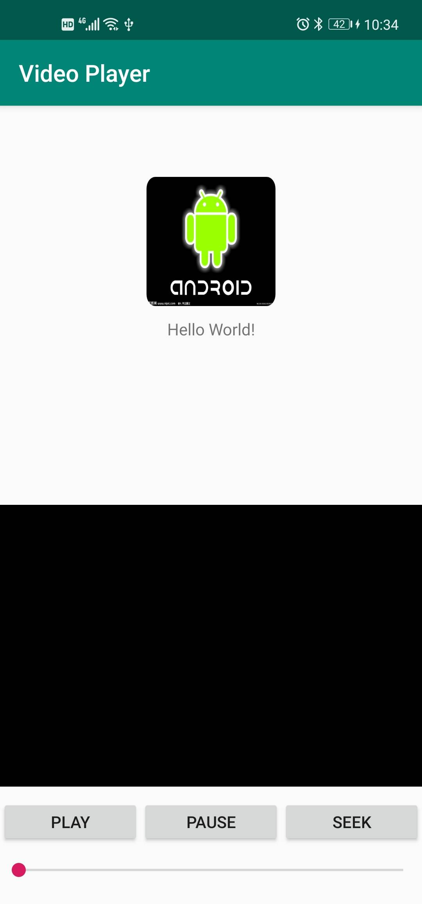
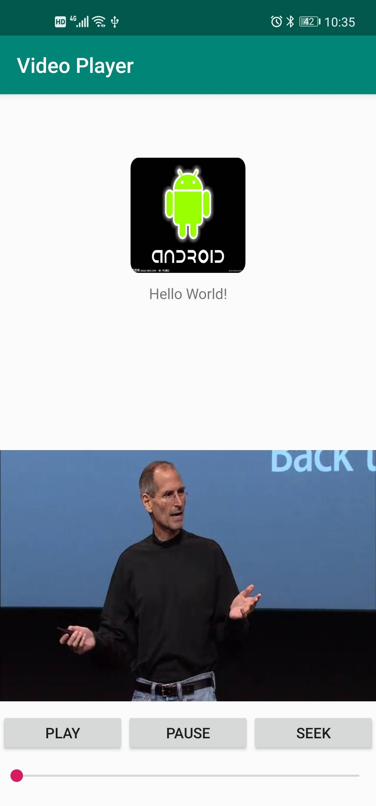
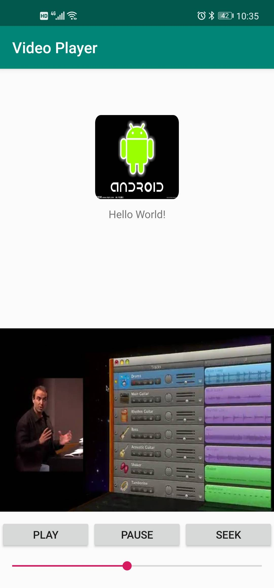
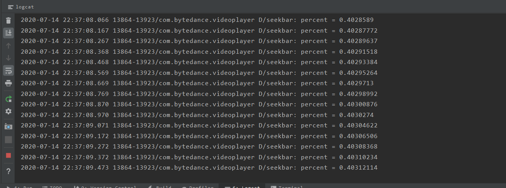

# Assignment5

代码在VideoPlayer文件夹中。

由于Github对md文件中图片格式的显示问题，缩放没有办法正常显示，本readme在网页端的图片大小可能看起来过大。可以clone下来，在其他软件上查看。

## Implementation

1. 渐变load网络图片，无法获取图片时显示失败:frowning_face:的表情
2. 网络图片圆角显示
3. PLAY开始播放网络视频，PAUSE暂停视频播放
4. 拖动进度条改变视频播放进度
5. 视频播放时进度条一起改动

## Environment

开发环境：Android Studio

## Result

1. 没有网络时：

2. 连接网络之后，加载图片过程（正在渐变）

3. 加载完成效果：

4. 播放视频：

5. 进度条拖到中间播放：

6. log观察视频进度：（百分比）

