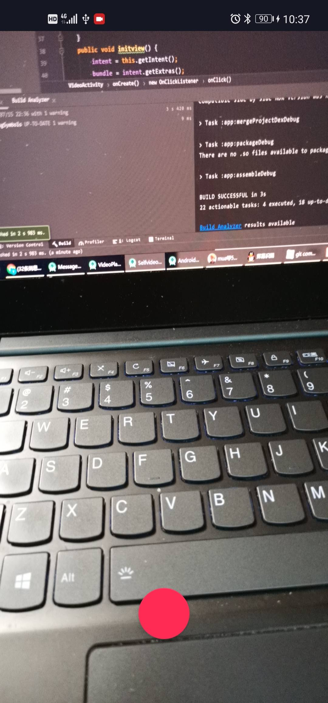
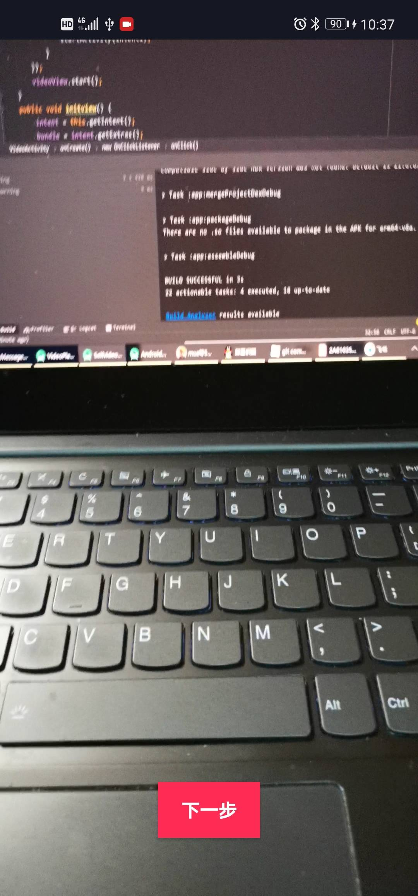

# Assignment8

代码在selfVideo文件夹中。

由于Github对md文件中图片格式的显示问题，缩放没有办法正常显示，本readme在网页端的图片大小可能看起来过大。可以clone下来，在其他软件上查看。

## Implementation

1. 点击加号进入相机预览界面
2. 点击红色按钮开始拍摄视频，再按一下结束拍摄
3. 拍完之后可以看到刚刚拍好的视频，点击下一步回到主页

## Environment

开发环境：Android Studio

## Result

1. 进入主页面，右下角加号开始拍视频

2. 正在拍视频界面

3. 播放刚刚拍好的视频界面：

